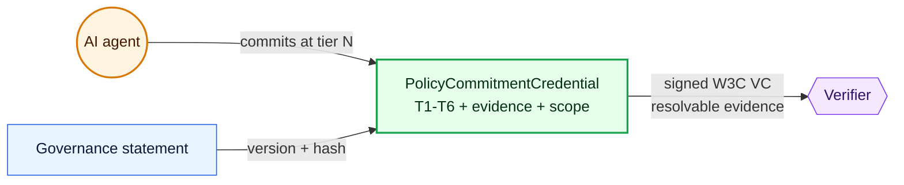

# Policy Commitment Attestation

**A specification for verifiable AI agent commitments to governance statements.**

## What PCA is

- A **[W3C Verifiable Credentials](https://www.w3.org/TR/vc-data-model-2.0/) credential type** (`PolicyCommitmentCredential`) binding an agent identity to a specific governance statement version.
- A **six-tier Commitment Maturity Ladder** — T1 Read → T6 Enforced — with normative evidence floors per tier.
- An **in-toto predicate type** for per-evidence-artifact linking (ADR, memory file, skill, PR commit, runtime hook).
- An **[OSCAL](https://pages.nist.gov/OSCAL/) mapping** so credentials export as `assessment-results` for FedRAMP-adjacent reporting.
- An **[ODRL](https://www.w3.org/TR/odrl-model/) profile** for machine-readable scope constraints and refusal rules.

## The Commitment Maturity Ladder

| Tier | Name | Meaning | Floor evidence |
|------|------|---------|----------------|
| **T1** | Read | Agent knows the statement exists and is bound by it | Agent DID + timestamp |
| **T2** | Understood | Agent can paraphrase, cite, surface in reasoning | Self-explanation; similarity ≥ 0.8 |
| **T3** | Adopted | Statement lives in the agent's working memory | Memory file, AGENTS.md fragment |
| **T4** | Codified | Durable repository artifact carries the commitment | ADR, skill, PR commit |
| **T5** | Bounded | Scope constraint / refusal rule applied | ODRL prohibitions |
| **T6** | Enforced | Runtime guardrail blocks violations | Hook, middleware, tool allowlist |

Tiers are cumulative — T6 includes T5 includes T4… all the way down.

## Get started

- **[SPEC.md](./SPEC.md)** — normative specification (v0.1 draft, §1–§11)
- **[examples/](https://github.com/dictiva/policy-commitment-attestation/tree/main/examples)** — three progression credentials: [T1 minimal](https://github.com/dictiva/policy-commitment-attestation/blob/main/examples/01-minimal-t1-read.jsonld), [T4 codified](https://github.com/dictiva/policy-commitment-attestation/blob/main/examples/02-t4-codified-with-adr.jsonld), [T6 enforced](https://github.com/dictiva/policy-commitment-attestation/blob/main/examples/03-t6-enforced-with-hook-and-refusal.jsonld)
- **[guide/implementation-guide.md](./guide/implementation-guide.md)** — reference implementation with DigitalBazaar TypeScript
- **[JSON-LD context](./contexts/policy-commitment/v1)** — canonical context document
- **[CONTRIBUTING.md](./CONTRIBUTING.md)** — how to propose changes
- **[GOVERNANCE.md](./GOVERNANCE.md)** — stewardship + AAIF transition path

## Reference implementation

[`smoke-test.mjs`](https://github.com/dictiva/dictiva/blob/main/scripts/attestix-spike/smoke-test.mjs) in the Dictiva repo is a reproducible end-to-end issue + verify round-trip. Clone, `cd scripts/attestix-spike`, `npm install`, `npm run smoke`.

## Status

**Version**: v0.1 draft · **Stage**: pre-[AAIF](https://aaif.io/) project proposal · **License**: Apache 2.0 · **Stewardship**: [Dictiva](https://dictiva.com), targeting Linux Foundation AAIF contribution.

## Related Dictiva ADRs

- [ADR-040 — PCA composition decision](https://github.com/dictiva/dictiva/blob/main/docs/decisions/040-policy-commitment-attestation.md)
- [ADR-042 — Attestix substrate decision (DigitalBazaar adopted)](https://github.com/dictiva/dictiva/blob/main/docs/decisions/042-attestix-substrate-decision.md)

## Feedback welcome

File issues on [the repository](https://github.com/dictiva/policy-commitment-attestation/issues). Review especially wanted from the W3C VC community, in-toto maintainers, the MCP working group, and AAIF TSC members.
